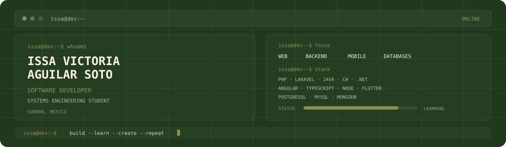

<!-- BANNER -->
<picture>
  <source media="(prefers-color-scheme: dark)" srcset="assets/banner-dark.v9.svg">
  <source media="(prefers-color-scheme: light)" srcset="assets/banner-light.v9.svg">
  
</picture>

 

<!-- NAME / TAGLINE -->

 

<!-- SOCIALS -->
&nbsp;&nbsp;

 

---

## This is me :)

Hi, I'm **Issa**, a Software Developer and Systems Engineering student from Sonora, Mexico 🇲🇽.  
I enjoy building applications, working with databases, and learning how different technologies connect to create useful software.

- 💻 **Systems Engineering student** at Universidad de Navojoa.
- 🚀 I build projects using **Laravel, Angular, .NET, Flutter and Node.js**.
- 🗄️ I work with databases such as **PostgreSQL, MySQL, Firebase and Supabase**.
- 🌐 Interested in **web development, backend development, APIs and software architecture**.
- 📱 I also enjoy **mobile development** with Flutter and Expo.
- 🧠 Currently improving my skills in **software development, cybersecurity and system design**.
- 🤝 I enjoy working on **collaborative projects** and learning from real-world development.
- 🌱 **My goal:** keep learning, build better software, and become a stronger developer every day.

 

## my perfect stack`

---

---

` Build with love · @Issa1616 `

